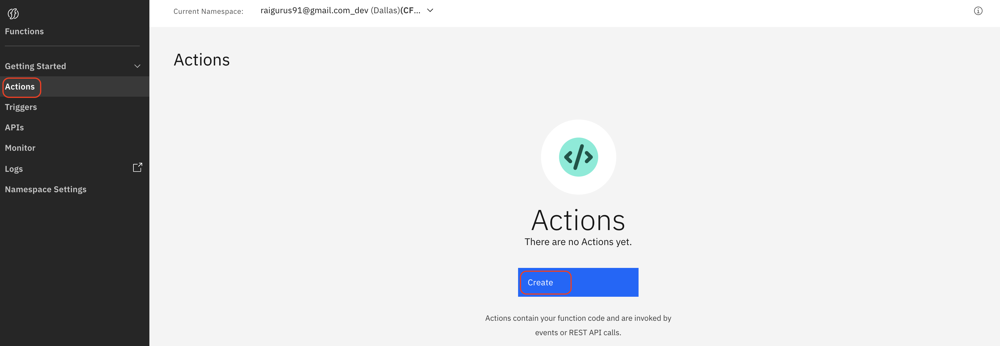
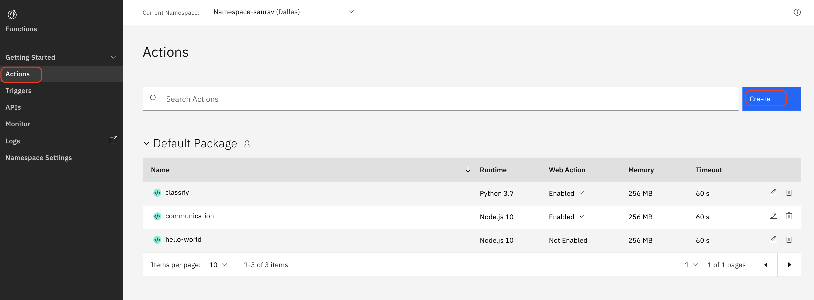
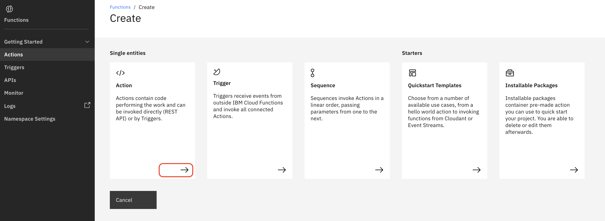
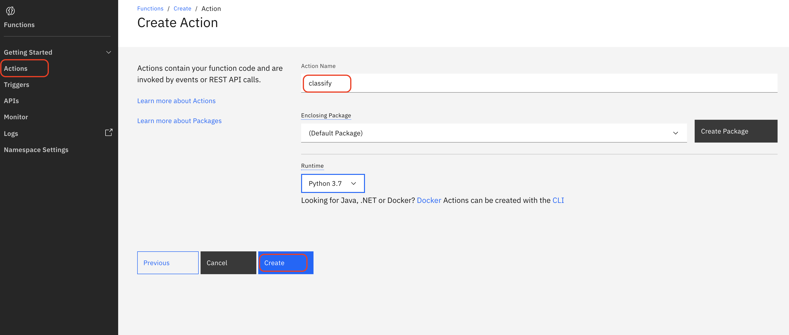
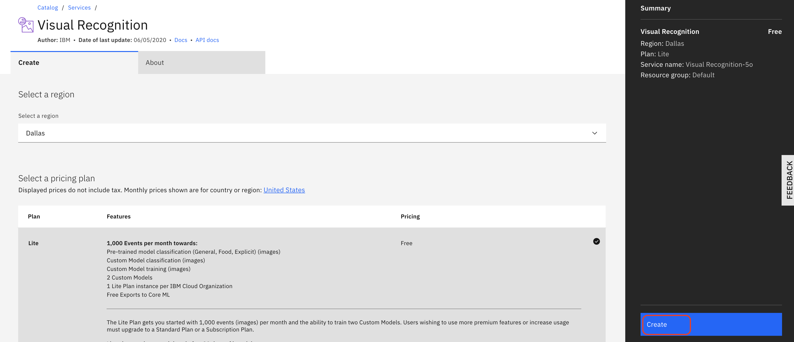
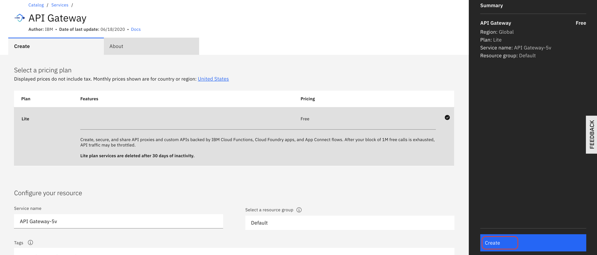
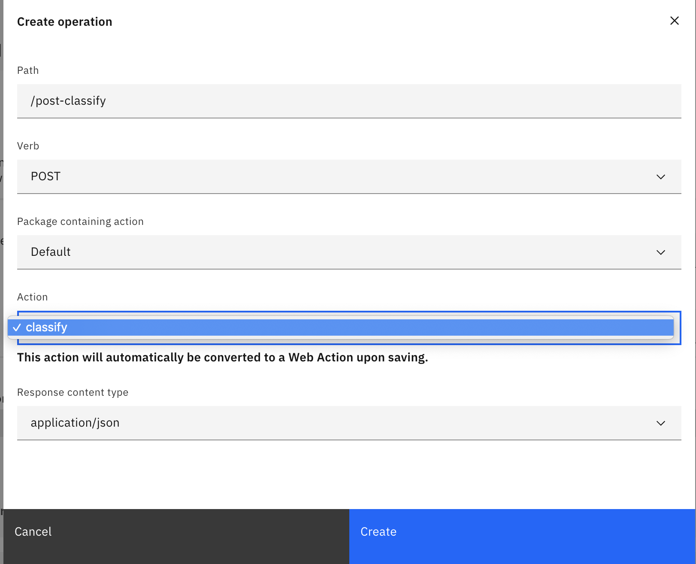
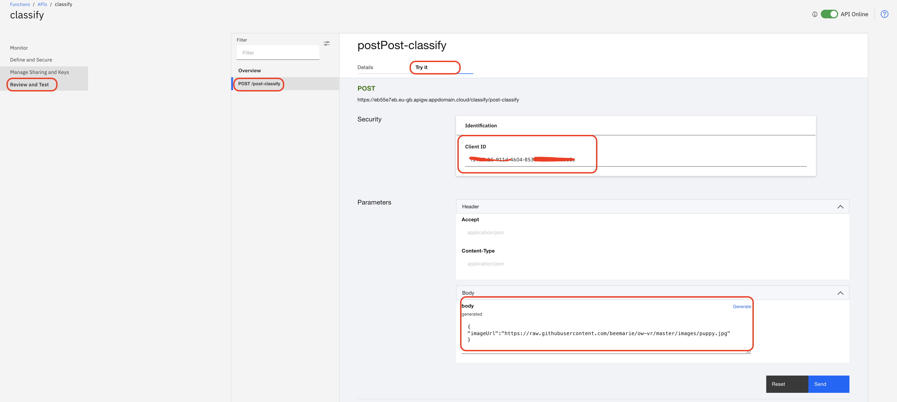
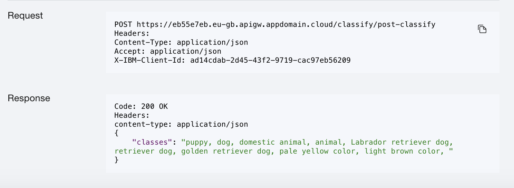

In this tutorial, we will be using IBM Cloud Functions (which is a serverless offering on IBM Cloud based on OpenWhisk) to create an action to classify images using IBM Visual Recognition service and then expose and secure the function by leveraging the API Gateway service.

The objective of this tutorial is to learn how to quickly create a function to do a particular task (classifying images) and expose the function as a standard API service in a secure way, such that it can be consumed by the right set of users having the authorization (apiKey and secrets) to authenticate the function.

## Prerequisites

* [IBM Cloud account](https://cloud.ibm.com/registration?cm_sp=ibmdev-_-developer-tutorials-_-cloudreg)
* A general understanding of [IBM Cloud Functions](https://cloud.ibm.com/docs/openwhisk) and [its concepts](https://cloud.ibm.com/functions/learn/concepts)
* A general understanding of API management tasks.

## Estimated time

Completing this tutorial should take about 30 minutes.

## Architecture for our sample app


## Steps

* Create an IBM Cloud Functions action for classifying images
* Test the IBM Cloud Functions action.
* Create an API endpoint for the IBM Cloud Functions action using API Gateway service.
* Test the API endpoint with Client ID authentication.

### Creating the IBM Cloud Functions action for classifying images

1. Log in to your IBM Cloud account, and then open [IBM Cloud Functions](https://cloud.ibm.com/functions/?cm_sp=ibmdev-_-developer-tutorials-_-cloudreg).

2. Click **Actions** in the left menu.

    If you are using IBM Cloud Functions for the first time, you'll see a screen like the following screen. Click the **Create** button.

    

    If not, you'll see your already existing actions in the Default Package section. Click the **Create** button.

    

3. Click on the right arrow in the Action tile.

      

4. Create your new sample Python action with the name `classify`.

      

5. Once the `classify` action is created, replace the default "hello world" function with the following code for recognizing images, and then click **Save**.

    ```

    from watson_developer_cloud import VisualRecognitionV3

    def main(params):
        # init visual recognition library
        apiKey = params['apiKey']
        version = "2018-03-19"
        visual_recognition = VisualRecognitionV3(version=version, iam_apikey=apiKey)

        # get image url from params
        image_url = params['imageUrl']

        # parse visual recognition return data for our tags
        tags = ""
        classifiedImages = visual_recognition.classify(url=image_url).get_result()
        image = classifiedImages['images'][0]
        classes = image['classifiers'][0]['classes']
        for theClass in classes:
            currentTag = theClass['class']
            print(currentTag)
            tags = tags + currentTag + ", "
        result = {'classes': tags}
        return result
    ```

3. Create a [Visual Recognition service](https://cloud.ibm.com/catalog/services/visual-recognition/?cm_sp=ibmdev-_-developer-tutorials-_-cloudreg).

    

4. Once the service is created, select **service credentials** from the left menu, expand the **Auto-generated service credentials**, and make a note of its `apiKey` value.

    

5. To call the Visual Recognition service from your `classify` action, we need to pass the `apiKey` in as a parameter. Let's set this up as a default parameter, so that we don't have to pass it into the action every time.

    Back in IBM Cloud Functions, in our `classify` action, click **Parameters** in the left menu, and then click **Add Parameter +**. For the parameter name, use `apiKey` with a capital K. For the parameter value, insert your apiKey value (from the previous step) enclosed in quotation marks. Then, click **Save**.

    

    **Important:** The apiKey parameter value is a bound parameter that cannot be deleted once bound. If saved with an incorrect value, you will need to delete the action and start again at the previous step.

### Testing our IBM Cloud Functions action

1. Click **Code** in the left menu, and then click **Invoke with parameters**.

2. Add the following JSON to the Change Action Input dialog. Then, click **Apply** to save the parameter.

    ```
    {
    "imageUrl":"https://raw.githubusercontent.com/sauravraiguru/serverless-gateways/master/images/puppy.jpg"    
    }
    ```

3. Click **Invoke**.

    We are using the Watson Visual Recognition service to identify and classify the image by passing an `imageUrl` along with the `apiKey` of the Visual Recognition service as authentication. The service analyzes the public image and returns the classification information of the image.

    After you click **Invoke**, watch the Activations window that displays on the right. Once the Watson Visual Recognition service completes its analysis, you should see a sample output as below.

    

    If you receive an `apiKey` or `imageUrl` error, check your parameter inputs.

### Creating an API Gateways service and an API endpoint in IBM Cloud Functions

1. Go to the [API Gateway Service](https://cloud.ibm.com/catalog/services/api-gateway?cm_sp=ibmdev-_-developer-tutorials-_-cloudreg) on IBM Cloud, and click **Create**.

    

2. Go to IBM Cloud Functions, and click [APIs](https://cloud.ibm.com/functions/apimanagement) from the left menu to create an API and its gateway to access our `classify` function.

3. Click **Create API**.

4. For the API name, specify `classify`.

5. Click **Create Operation**.  Specify `post-classify` for the Path, select `POST` from the **Verb** drop-down, choose the action `Classify` that you created earlier from the **Functions** drop-down, and then click **Create**.

    

6. To secure the API endpoint, scroll down to the Security and Rate Limiting section. Enable the **Require authentication via API Key** option.

    

7. Scroll down to the bottom of this page, and click **Create**.

### Testing the image classification API Endpoint

1. On the Summary page for the API, we can see the API endpoint link, the status (online or offline) of our API, and other information.  From the left menu, click **Manage Sharing and Keys**.  Then, click **Create API Key**.

    

2. Specify a descriptive name, such as `X-IBM-Client-Id`, and click **Create** to generate a API key. Make a note of the `generated key value` of the Client ID Key.

    

3. Try using the `POST /post-classify` API with the Client ID Key. From the left menu, click **Review and Test**.  Then, click **POST /**, and click the **Try it** tab. This is the swagger that is provided for testing your API.

    

4. In the Try it tab, specify the `X-IBM-Client-Id` generated key's value that you noted earlier. Also, paste `imageUrl` value in the body parameter.  Then, click **Send**.

    ```
    {
    "imageUrl":"https://raw.githubusercontent.com/sauravraiguru/serverless-gateways/master/images/puppy.jpg"    
    }
    ```

    You should see a sample API response having the image classification below, which was received upon invoking an API call by passing a secure `client ID` and `imageUrl`.

    

## Summary and next steps

In this tutorial, you learned how to use IBM Visual Recognition service to classify images and how to use IBM Cloud Functions create a serverless action. Finally, you learned how to use the API Gateway service to securely expose the serverless function by creating and testing an API Endpoint.

To further explore and understand API Management using [IBM API Connect](https://cloud.ibm.com/catalog/services/api-connect?cm_sp=ibmdev-_-developer-tutorials-_-cloudreg), try out the [Managing your APIs throughout the API lifecycle](/tutorials/create-and-manage-apis-using-api-connect/) tutorial.

## Authors:
  - name: `Saurav Raiguru` email: `saurav.raiguru@in.ibm.com`
